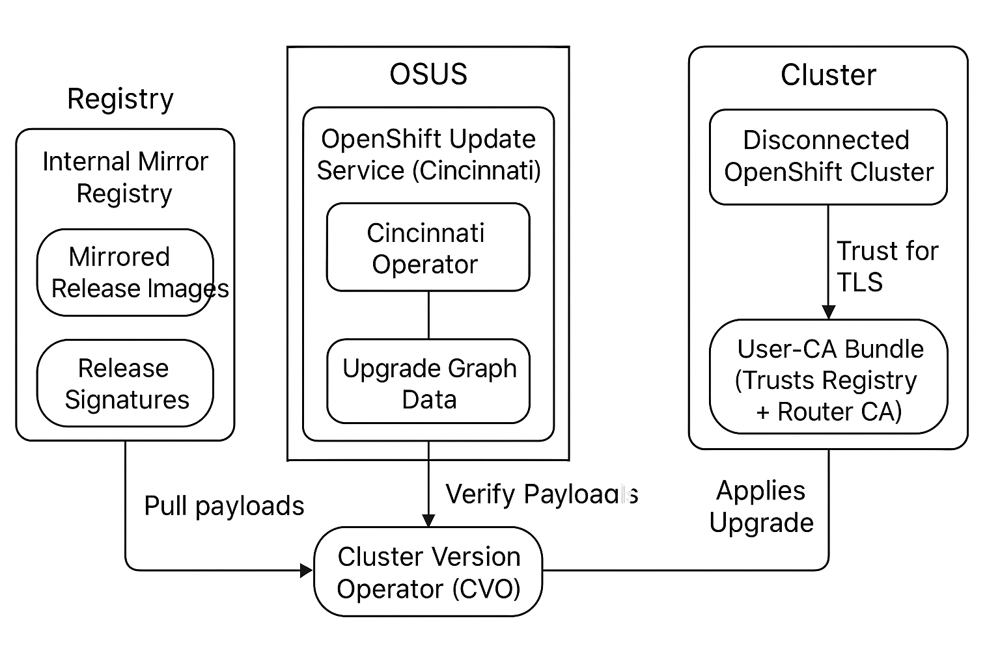

# Upgrade in Airgapped Environment

Upgrading OpenShift in a **disconnected (airgapped)** environment requires additional steps compared to a connected cluster.  
Because the cluster cannot reach Red Hat’s public update services, you must provide your own **OpenShift Update Service (OSUS)** and configure it to trust your **internal registries** and **certificates**.

This document walks through the steps needed to set up OSUS and perform upgrades.

---

## Pre-requisites
- Update the operators to the latest versions.
- Install the **cincinnati-operator** (this operator powers OSUS).
- Update the `oc` CLI to the latest version.

**Why:**  
Operators must be upgraded first to ensure they are compatible with the target OpenShift version.  
The Cincinnati operator provides the graph data and policies required for controlled upgrades.  
The CLI tool must be up to date so it understands new cluster APIs and commands.

**Reference:**  
[Disconnected Environment Updates - Red Hat Docs](https://docs.redhat.com/en/documentation/openshift_container_platform/4.18/html/disconnected_environments/updating-a-cluster-in-a-disconnected-environment#updating-disconnected-cluster-osus)

---

## Workflow Overview
The high-level process:

1. **Install the Cincinnati operator** – provides the policy engine for upgrades.  
2. **Apply mirrored release signatures** – ensures payloads are trusted.  
3. **Configure registry access** – so the cluster can pull mirrored images.  
4. **Add router CA to trust bundle** – allows the CVO to talk to OSUS via ingress.  
5. **Create the OSUS application** – deploys a local “over-the-air” update service.  
6. **Configure the CVO** – point your cluster at the local OSUS service.  
7. **Upgrade other clusters using OSUS** – re-use the same update service across multiple disconnected clusters.  

---

## Step 1: Install the Cincinnati Operator

**What:**  
Install the **Cincinnati operator** (the operator that provides policy/graph functionality used by the OpenShift Update Service).

**Why:**  
Cincinnati (the graph/policy engine) is the component that serves upgrade graph data and policies the Cluster Version Operator (CVO) consumes to determine valid upgrade paths. The operator must be installed and healthy before you point CVO at a local update service.

**How (high level):**
- Install via the Operator Lifecycle Manager (OLM) / OperatorHub in your environment (subscribe to the Cincinnati operator from your mirrored operator catalog), or apply the operator manifests from your mirrored operator bundle if you are not using the console.
- Verify the operator is installed and healthy (check subscription/CSV and operator pods).

**Example verification commands:**
```bash
# Check CSV / subscription state (replace namespace if different)
oc get subscription -n <operator-namespace>
oc get csv -n <operator-namespace>

# Check operator pods
oc get pods -n <operator-namespace> --selector=<operator-selector-if-known>
```

> Tip: install the operator from your mirrored catalog (not from the public catalog) so the install succeeds in an airgapped environment.

---

## Step 2: Apply Mirrored Release Image Signatures (release-signatures)

**What:**  
Apply the `release-signatures` produced by your `oc-mirror` run. These are the release verification artifacts (signatures/keys) that allow the CVO to verify mirrored release payloads.

**Why:**  
OpenShift verifies the authenticity of release payloads using release signatures. If signatures are missing or not applied to the cluster, CVO will refuse to verify the mirrored payload and the upgrade will fail with messages like *“The update cannot be verified…”* or *verifier-public-key-redhat* errors.

**How (example):**
```bash
# From your oc-mirror output directory (example path from oc-mirror)
oc apply -f ./oc-mirror-workspace/results-1639608409/release-signatures/
```

**What to verify after applying:**
- Confirm the `release-signatures` resources were created/applied in the cluster (the exact resource type depends on your oc-mirror output — check the files in the `release-signatures` directory).
- Attempt a dry-check or an `oc adm upgrade` (or check CVO logs/conditions) to ensure the payloads are now verifiable by the cluster.

**Notes:**  
- Order matters: install the Cincinnati/operator (Step 1) **first**, then apply the release-signatures. Cincinnati/OSUS must be present so the graph/policy components can use the signatures when CVO queries them.
- If you mirror multiple release versions, ensure all corresponding signature files are applied.

---

## Step 3: Configure Access to a Secured Registry
Disconnected clusters rely on your **internal registry mirror**.  
The cluster must trust the registry’s TLS certificates before it can pull images.

**What to do:**
- Create a ConfigMap containing your registry’s CA certificate(s).
- Reference this ConfigMap in the cluster-wide `Image` configuration.

```yaml
apiVersion: v1
kind: ConfigMap
metadata:
  name: my-registry-ca
data:
  updateservice-registry: |
    -----BEGIN CERTIFICATE-----
    ...
    -----END CERTIFICATE-----
  registry-with-port.example.com..5000: |
    -----BEGIN CERTIFICATE-----
    ...
    -----END CERTIFICATE-----
```

Alternatively:

```bash
oc create configmap my-registry-ca   --from-file=registry-with-port.example.com..5000=</path/to/example-ca.crt>   -n openshift-config
```

Patch the cluster config:

```yaml
spec:
  additionalTrustedCA:
    name: registry-config
```

**Why:**  
If the cluster does not trust your registry’s certificate, all image pulls will fail with TLS errors such as  
`x509: certificate signed by unknown authority`.

---

## Step 4: Add Router CA to the User CA Bundle
The CVO must contact the **OSUS service endpoint** through your cluster’s ingress router.  
By default, the router issues its own self-signed CA, which is not trusted by the CVO.

**What to do:**
- Extract the router CA certificate:
  ```bash
  oc get secret -n openshift-ingress-operator router-ca -o yaml
  ```
- Add the certificate to the cluster’s `user-ca-bundle`.

**Why:**  
If the ingress CA is not trusted, the CVO cannot talk to the OSUS service.  
This results in errors like:  
`CVO is showing x509: certificate is signed by unknown authority`.

**Reference:**  
[Adding Ingress Router CA](https://docs.redhat.com/en/documentation/openshift_container_platform/4.18/html/disconnected_environments/updating-a-cluster-in-a-disconnected-environment#update-service-create-service_updating-disconnected-cluster-osus)

---

## Step 5: Create an OSUS Application
Deploy the OSUS service using the `updateservice.yaml` generated by **oc-mirror**.

**Why:**  
This application serves the **upgrade graph** that the CVO consumes.  
It replicates the “Over-the-Air Updates” experience but inside your disconnected environment.

**Reference:**  
[Create OSUS Application](https://docs.redhat.com/en/documentation/openshift_container_platform/4.18/html/disconnected_environments/updating-a-cluster-in-a-disconnected-environment#update-service-create-service_updating-disconnected-cluster-osus)

---

## Step 6: Configure the Cluster Version Operator (CVO)
The CVO needs to be pointed at your local OSUS service instead of Red Hat’s public one.

**What to do:**
```bash
NAMESPACE=openshift-update-service
NAME=service

POLICY_ENGINE_GRAPH_URI="$(oc -n "${NAMESPACE}" get -o jsonpath='{.status.policyEngineURI}/api/upgrades_info/v1/graph{"
"}' updateservice "${NAME}")"
PATCH="{\"spec\":{\"upstream\":\"${POLICY_ENGINE_GRAPH_URI}\"}}"

oc patch clusterversion version -p $PATCH --type merge
```

**Why:**  
By default, the CVO looks at `api.openshift.com` for updates.  
In a disconnected cluster, this will fail.  
This patch redirects the CVO to your local OSUS.

---

## Step 7: Upgrade Other Clusters Using OSUS
Once OSUS is working, you can point other disconnected clusters to the same service.

**Steps:**
1. Retrieve the OSUS route:
   ```bash
   POLICY_ENGINE_GRAPH_URI="$(oc -n openshift-update-service get updateservice <update-service-name> -o jsonpath='{.status.policyEngineURI}/api/upgrades_info/v1/graph')"
   echo $POLICY_ENGINE_GRAPH_URI
   ```
2. Patch each cluster:
   ```bash
   PATCH="{\"spec\":{\"upstream\":\"${POLICY_ENGINE_GRAPH_URI}\"}}"
   oc patch clusterversion version -p $PATCH --type merge
   ```

3. If upgrades stall due to missing signatures, force them:
   ```bash
   oc patch clusterversion version --type json -p '[{"op": "add", "path": "/spec/desiredUpdate/force", "value": true}]'
   ```

**Why:**  
This enables you to run a **centralized update service** for multiple clusters, instead of replicating OSUS everywhere.

---

## Architecture Diagram – Single Cluster

```mermaid
flowchart TD
    subgraph Registry["Mirror Registry"]
        Images[(Mirrored Release Images)]
        Signatures[(Release Signatures)]
    end

    subgraph OSUS["OpenShift Update Service (Cincinnati)"]
        Operator[Cincinnati Operator]
        Graph[Upgrade Graph Data]
    end

    subgraph Cluster["Disconnected OpenShift Cluster"]
        CVO[Cluster Version Operator (CVO)]
        UserCA[User-CA Bundle (Trusts Registry + Router CA)]
    end

    Registry -->|Pull payloads| CVO
    Signatures -->|Verify Payloads| CVO
    Operator --> Graph
    Graph -->|Provide Upgrade Graph| CVO
    UserCA -->|Trust for TLS| CVO

    CVO -->|Applies Upgrade| Cluster
```
## Architecture Diagram – Single Cluster




<svg xmlns="http://www.w3.org/2000/svg" width="679.5" height="491.5" viewBox="0 0 679.5 491.5"><g stroke="#000" stroke-width="1" transform="translate(.5 .5)"><g class="output"><g class="clusters"><g id="cluster-Registry" class="cluster" transform="translate(19 19)"><rect width="216" height="123" x="-108" y="-61.5" class="cluster-rect"/><text text-anchor="middle" x="0" y="-45.9" class="cluster-label">Mirror Registry</text></g><g id="cluster-OSUS" class="cluster" transform="translate(528.5 70.5)"><rect width="286" height="123" x="-143" y="-61.5" class="cluster-rect"/><text text-anchor="middle" x="0" y="-45.9" class="cluster-label">OpenShift Update Service (Cincinnati)</text></g><g id="cluster-Cluster" class="cluster" transform="translate(330.5 350)"><rect width="324" height="159" x="-162" y="-79.5" class="cluster-rect"/><text text-anchor="middle" x="0" y="-63.9" class="cluster-label">Disconnected OpenShift Cluster</text></g></g><g class="nodes"><g id="node-Images" class="node" transform="translate(19 23.5)"><rect width="176" height="39" x="-88" y="-19.5" rx="0" ry="0"/><text text-anchor="middle" x="0" y="5.1" font-size="14px" fill="#000"><tspan x="0">(Mirrored Release Images)</tspan></text></g><g id="node-Signatures" class="node" transform="translate(19 92.5)"><rect width="154" height="39" x="-77" y="-19.5" rx="0" ry="0"/><text text-anchor="middle" x="0" y="5.1" font-size="14px" fill="#000"><tspan x="0">(Release Signatures)</tspan></text></g><g id="node-Operator" class="node" transform="translate(528.5 42.5)"><rect width="146" height="39" x="-73" y="-19.5" rx="0" ry="0"/><text text-anchor="middle" x="0" y="5.1" font-size="14px" fill="#000"><tspan x="0">Cincinnati Operator</tspan></text></g><g id="node-Graph" class="node" transform="translate(528.5 111.5)"><rect width="168" height="39" x="-84" y="-19.5" rx="0" ry="0"/><text text-anchor="middle" x="0" y="5.1" font-size="14px" fill="#000"><tspan x="0">Upgrade Graph Data</tspan></text></g><g id="node-CVO" class="node" transform="translate(330.5 321.5)"><rect width="210" height="39" x="-105" y="-19.5" rx="0" ry="0"/><text text-anchor="middle" x="0" y="5.1" font-size="14px" fill="#000"><tspan x="0">Cluster Version Operator (CVO)</tspan></text></g><g id="node-UserCA" class="node" transform="translate(330.5 390.5)"><rect width="284" height="39" x="-142" y="-19.5" rx="0" ry="0"/><text text-anchor="middle" x="0" y="5.1" font-size="14px" fill="#000"><tspan x="0">User-CA Bundle (Trusts Registry + Router CA)</tspan></text></g></g><g class="edgePaths"><g id="edge-Registry-CVO" class="edge-path" stroke="#333"><path d="M117.43,82.5 C161.43,130.5 241.43,218.5 292.43,277.5"/><text text-anchor="middle" x="194.93" y="176.4" class="edge-label">Pull payloads</text></g><g id="edge-Signatures-CVO" class="edge-path" stroke="#333"><path d="M96.53,111.5 C147.53,158.5 237.53,243.5 293.53,293.5"/><text text-anchor="middle" x="190.03" y="248.9" class="edge-label">Verify Payloads</text></g><g id="edge-Operator-Graph" class="edge-path" stroke="#333"><path d="M528.5,62 C528.5,70 528.5,80.5 528.5,89.5"/><text text-anchor="middle" x="513.5" y="75.9"/></g><g id="edge-Graph-CVO" class="edge-path" stroke="#333"><path d="M485.87,130.5 C456.87,166.5 407.87,226.5 367.87,271.5"/><text text-anchor="middle" x="461.37" y="196.4" class="edge-label">Provide Upgrade Graph</text></g><g id="edge-UserCA-CVO" class="edge-path" stroke="#333"><path d="M330.5,371 C330.5,363 330.5,352.5 330.5,343.5"/><text text-anchor="middle" x="372.5" y="357.4" class="edge-label">Trust for TLS</text></g><g id="edge-CVO-Cluster" class="edge-path" stroke="#333"><path d="M330.5,341 C330.5,357.5 330.5,385.5 330.5,406.5"/><text text-anchor="middle" x="378" y="373.9" class="edge-label">Applies Upgrade</text></g></g></g></g></svg>
---

## Architecture Diagram – Multi-Cluster Setup

```mermaid
flowchart TD
    subgraph Registry["Internal Mirror Registry"]
        Images[(Mirrored Release Images)]
        Signatures[(Release Signatures)]
    end

    subgraph OSUS["Centralized OpenShift Update Service"]
        Operator[Cincinnati Operator]
        Graph[Upgrade Graph Data]
    end

    subgraph ClusterA["Cluster A"]
        CVOA[Cluster Version Operator (CVO)]
    end

    subgraph ClusterB["Cluster B"]
        CVOB[Cluster Version Operator (CVO)]
    end

    subgraph ClusterC["Cluster C"]
        CVOC[Cluster Version Operator (CVO)]
    end

    Registry -->|Pull payloads| CVOA
    Registry -->|Pull payloads| CVOB
    Registry -->|Pull payloads| CVOC

    Signatures -->|Verify Payloads| CVOA
    Signatures -->|Verify Payloads| CVOB
    Signatures -->|Verify Payloads| CVOC

    Operator --> Graph
    Graph -->|Provide Upgrade Graph| CVOA
    Graph -->|Provide Upgrade Graph| CVOB
    Graph -->|Provide Upgrade Graph| CVOC

    CVOA -->|Applies Upgrade| ClusterA
    CVOB -->|Applies Upgrade| ClusterB
    CVOC -->|Applies Upgrade| ClusterC
```

---

## Quick Reference Summary Table

| **Step** | **Purpose** | **Key Action / Command** |
|----------|-------------|---------------------------|
| 1. Install Cincinnati Operator | Provides upgrade graph/policy engine for OSUS | Install operator from mirrored catalog, verify pods and CSV |
| 2. Apply Release Signatures | Allow CVO to verify mirrored release payloads | `oc apply -f ./oc-mirror-workspace/.../release-signatures/` |
| 3. Configure Registry Access | Trust internal registry TLS certs | Create ConfigMap with CA → reference in `Image` config |
| 4. Add Router CA | Trust ingress router CA so CVO can reach OSUS | Extract `router-ca` secret → add to `user-ca-bundle` |
| 5. Create OSUS Application | Deploy local update service | Apply `updateservice.yaml` from `oc-mirror` output |
| 6. Configure CVO | Point cluster to OSUS instead of api.openshift.com | Patch `clusterversion` with `POLICY_ENGINE_GRAPH_URI` |
| 7. Upgrade Other Clusters | Reuse OSUS for multiple clusters | Patch CVO upstream on each cluster, force upgrade if stuck |

---

## Happy Path Runbook (Minimal Checklist)

Follow this sequence for a straightforward upgrade in a disconnected environment.  
Replace variables (like `<namespace>`, `<update-service-name>`, and paths) as needed.

### 1. Install the Cincinnati Operator
```bash
# From your mirrored operator catalog
oc get subscription -n openshift-operators
oc get csv -n openshift-operators
```

Verify the Cincinnati operator is installed and running.

---

### 2. Apply Release Signatures
```bash
oc apply -f ./oc-mirror-workspace/results-*/release-signatures/
```

---

### 3. Configure Registry Trust
```bash
oc create configmap my-registry-ca   --from-file=registry-with-port.example.com..5000=</path/to/example-ca.crt>   -n openshift-config

oc edit image.config.openshift.io cluster
# Set:
# spec:
#   additionalTrustedCA:
#     name: my-registry-ca
```

---

### 4. Add Router CA to User-CA Bundle
```bash
oc get secret -n openshift-ingress-operator router-ca -o yaml > router-ca.yaml
# Extract the certificate and add it to your user-ca-bundle configmap
```

---

### 5. Deploy the OSUS Application
```bash
oc apply -f ./oc-mirror-workspace/results-*/updateservice.yaml
```

---

### 6. Configure the CVO to Use OSUS
```bash
NAMESPACE=openshift-update-service
NAME=service

POLICY_ENGINE_GRAPH_URI="$(oc -n "${NAMESPACE}" get -o jsonpath='{.status.policyEngineURI}/api/upgrades_info/v1/graph' updateservice "${NAME}")"

PATCH="{\"spec\":{\"upstream\":\"${POLICY_ENGINE_GRAPH_URI}\"}}"
oc patch clusterversion version -p $PATCH --type merge
```

---

### 7. Upgrade Other Clusters (Optional)
```bash
# On each cluster you want to connect to the same OSUS
PATCH="{\"spec\":{\"upstream\":\"${POLICY_ENGINE_GRAPH_URI}\"}}"
oc patch clusterversion version -p $PATCH --type merge

# If upgrade stalls (signatures issue), force upgrade
oc patch clusterversion version --type json -p '[{"op": "add", "path": "/spec/desiredUpdate/force", "value": true}]'
```

---

✅ At this point, your cluster(s) should be able to upgrade in the same way as connected clusters, but using your **local registry** and **local OSUS**.

---

## References
- [Disconnected Environments - Red Hat Docs](https://docs.redhat.com/en/documentation/openshift_container_platform/4.18/html/disconnected_environments/)
- [Configuring Registry Access](https://docs.redhat.com/en/documentation/openshift_container_platform/4.18/html/disconnected_environments/updating-a-cluster-in-a-disconnected-environment#registry-configuration-for-update-service_updating-disconnected-cluster-osus)
- [OpenShift Update Service - Medium Guide](https://medium.com/@hillayamir/openshift-update-service-your-personal-over-the-air-update-service-776b43230011)